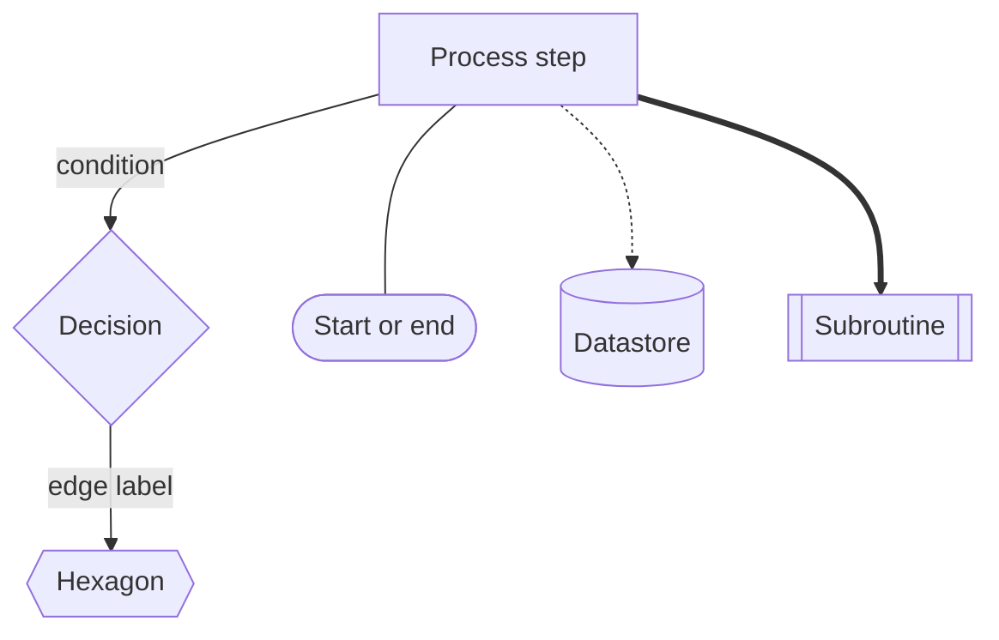
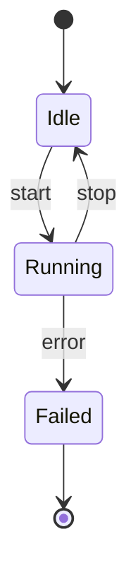
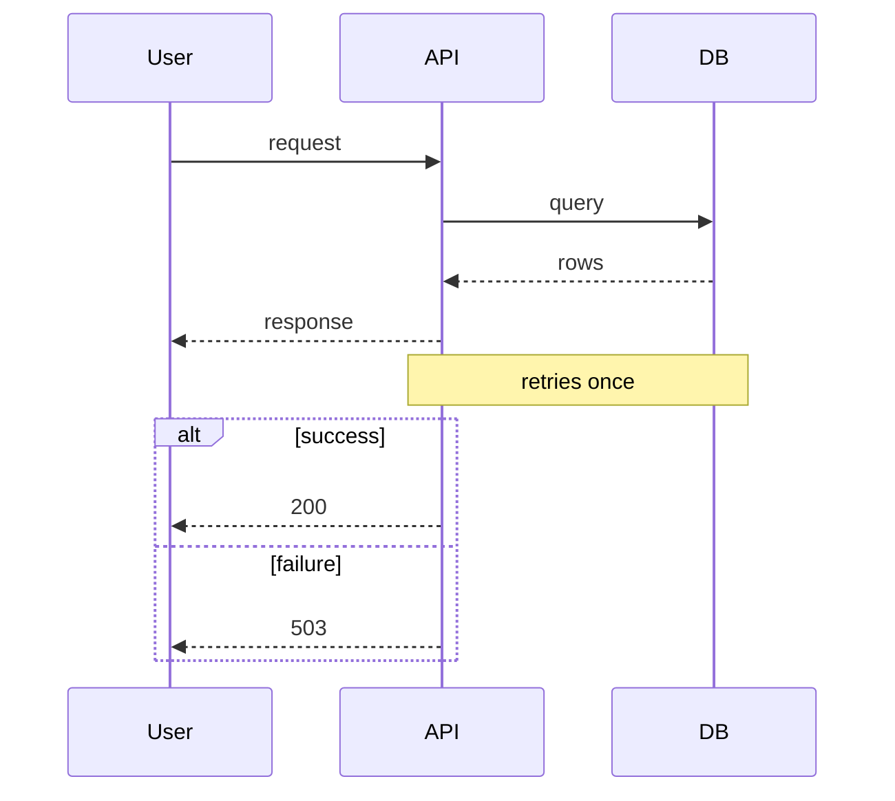
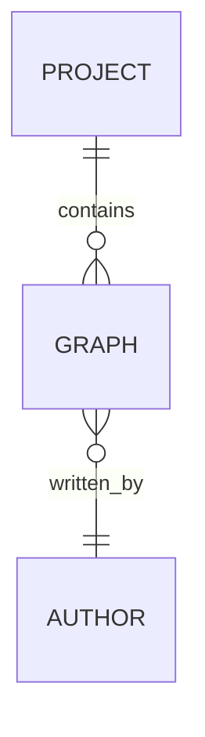
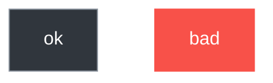

# Mermaid syntax that parses

Mermaid's parser is stricter than it looks. These rules keep diagrams valid.

## General

- Start with the diagram keyword on the first non-comment line:
  `flowchart TD`, `stateDiagram-v2`, `sequenceDiagram`, `erDiagram`, `gantt`.
- Comments are `%%` at the start of a line.
- Quote any label containing punctuation, spaces around special characters, or
  a slash that is not part of a path: `A["Retry (max 3)"]`.
- Do not use a reserved word as a node id: `end`, `graph`, `class`, `click`,
  `style`, `o`, `x`, `subgraph`. Rename to `endNode`, `graphNode`, etc.
- `end` in a flowchart must be on its own line to close a `subgraph`.

## Flowchart

- Arrow forms: `-->`, `---`, `-.->`, `==>`, `--x`, `--o`, `o--o`, `x--x`.
- Edge labels: `-->|text|` or `-- text -->`. Prefer `|text|`.
- Multi-target: `A --> B & C`. Use sparingly; it can confuse readers.
- Chained: `A --> B --> C`.

## State diagram

- `[*]` is the initial and/or final state.
- Transition labels come after `:`.
- Composite state: `state Active { ... }`.

## Sequence diagram

- `->>` request, `-->>` response, `-)` async. Participant aliases with `as`.
- Control blocks: `alt/else/end`, `opt`, `loop`, `par/and`.

## ER diagram

- Cardinality: `||--o{` one-to-many, `}o--||` many-to-one, `||--||` one-to-one.
- Attribute blocks: `PROJECT { string id PK }`.

## Styling

- `classDef name fill:#rrggbb,stroke:#rrggbb,color:#rrggbb`.
- Apply with `:::name` on a node or `class A,B name`.
- `linkStyle 0 stroke:#f85149` to colour an edge by index (fragile — use only
  for effect, never for meaning the reader must decode).

## Common parse failures

| Symptom | Cause | Fix |
| --- | --- | --- |
| "Parse error on line N" at a bracket | Unbalanced or nested bracket shapes | Close every `[`, `(`, `{`; don't nest `[[` inside `[` |
| Diagram renders as one node | Missing diagram keyword | Add `flowchart TD` |
| Text after `%` disappears | `%` is not a comment marker | Use `%%` |
| `end` breaks the graph | `end` used as an id | Rename the node |
| Label truncated at `;` or `#` | Unquoted special character | Wrap in `"double quotes"` |
| Edge label swallows the arrow | `--` spacing wrong | Use `-->|label|` |

## Sanity checklist before presenting

1. First line is a diagram keyword.
2. Balanced brackets on every node definition.
3. No reserved words as ids.
4. Every decision edge labelled.
5. `end` only closes a `subgraph`.
6. Labels free of unquoted `;`, `#`, `%`, and stray parentheses.
